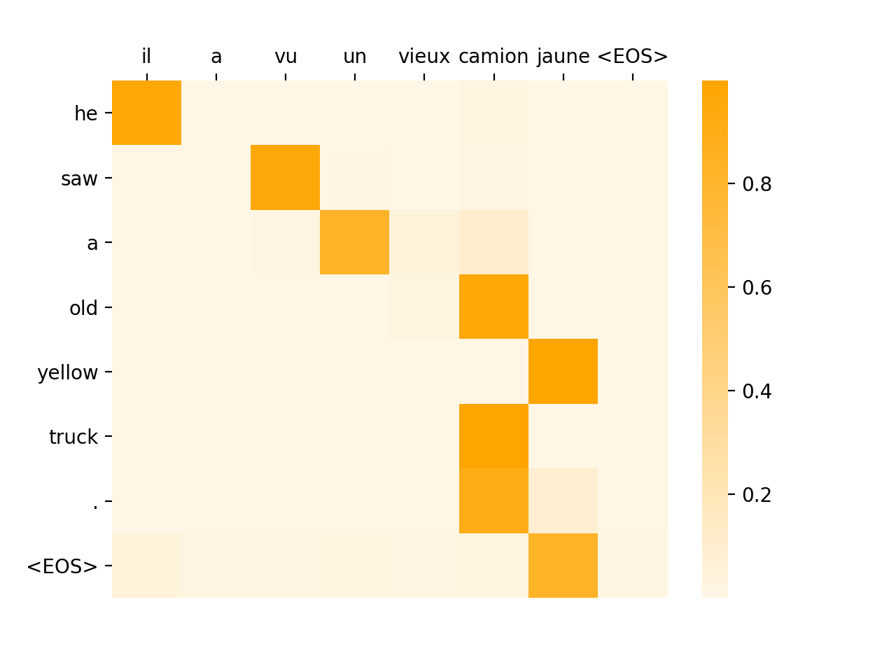

# nlp-attention-pytorch
Pytorch implementation of sequence-to-sequence translate models

## Usage
Train
```bash
python train.py --config configs/train_config.yaml
```
Translate
```bash
python translate.py --config configs/translate_conifig.yaml --show-attention
```

## Result

Sample attention matrix